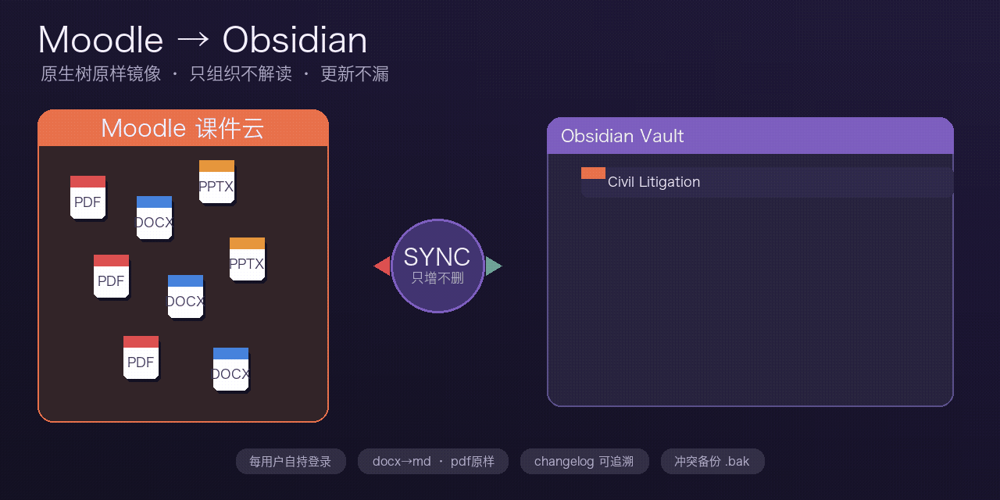

# Moodle → Obsidian

<p align="center">
  
</p>

<p align="center"><em>Moodle 课件 → 自动落进 Obsidian · 结构不乱 · 更新不漏</em></p>

把 Moodle 上的课件，按原来的文件夹样子，放进你的 Obsidian 库；需要时还能查作业截止日期、成绩与每日简报。  
系统**只负责搬运、组织和查询**，不替你总结重点、不改你的笔记习惯。

目前登录流程以 **HKU Moodle（CAS）** 验证过；其它学校只要支持 Moodle 移动端 token / `moodle-dl`，课件镜像与伴生层同样可用。

---

## 产品能力一览

| 能力 | 一句话 | 要不要你盯着 |
|---|---|---|
| **① 拉取 / 更新** | 从 Moodle 把课件增量下载到本机 | 登录一次后，系统做 |
| **② 映射进 Obsidian** | 把下载树原样放进各课 `99 Moodle Mirror/` | 系统做；可与①分开 |
| **伴生 Markdown** | docx 可搜；pdf 不动；pptx 抽文字并标明降级 | 按需跑 |
| **进度层（moodle-mcp）** | 作业、ddl、逾期、成绩、课程健康、每日 briefing | 按需问，非常驻 |
| **五原则凝结** | 镜像齐了之后，用通用方法整理笔记（需你确认再写） | 可选，不进同步管道 |

---

## 核心两段论（先分清）

整件事的主干是流水线的两步，**可以一起跑，也可以分开跑**：

```text
① 拉取 / 更新          从 Moodle 把课件下载到本机缓存（moodle-sync/）
② 映射进 Obsidian      把缓存里的树，原样放进各课的「99 Moodle Mirror」
```

| 段 | 干什么 | 你怎么说 | 对应命令 |
|---|---|---|---|
| **① 拉取** | 联网，增量拉新文件 / 更新 | 「帮我拉取 / 更新 Moodle」 | 下载器写入 `moodle-sync/` |
| **② 映射** | 把已下载内容写进 Obsidian（可不联网） | 「帮我映射进库 / 同步进 Obsidian」 | `mirror.py sync` |
| **①+②** | 先拉再映射 | 「拉取并同步到 Obsidian」 | `mirror.py run` |

所以：

- **不是**「说一句就永远全自动、不用再管」  
- **是**：你第一次（或凭证失效时）在浏览器里**登录一次**；之后按需要下指令——只要①、只要②，或两段一起  

登录是一次性验证；**拉取**和**映射**是两个可分开的产品动作。

### 你 vs 系统

| | 谁做 |
|---|---|
| 浏览器里登录 Moodle（通常只需一次） | **你** |
| ① 从 Moodle 下载 / 增量更新 | **系统** |
| ② 按原结构映射进 Obsidian，写更新日志与索引 | **系统** |
| 决定这次只要①、只要②，还是一起 | **你**（或吩咐 agent） |
| 查 ddl / 成绩 / briefing（moodle-mcp） | **系统**按需查；你决定问什么 |
| 凝结笔记是否写入 vault | **你确认**之后系统才写 |

密码改了、或同步提示登录失败时，再登录一次即可。

---

## 第一次怎么用

1. 把本仓库交给 AI agent，或按 [`SKILL.md`](SKILL.md) 准备本机环境（安装下载器、生成配置模板等）  
2. **系统打开浏览器** → 你用学校账号**登录一次** Moodle（HKU 按页面提示完成即可）  
3. 登录完成后，选一种跑法：  
   - 只要更新课件缓存 → **①**  
   - 缓存已有、只要进 Obsidian → **②**  
   - 从头到尾一次做完 → **①+②**（`run`）  
4. 打开 Obsidian：对应课程下出现 `99 Moodle Mirror/`，结构和 Moodle 上一样  

### 成功时长什么样

- 本机有一份 Moodle 下载缓存（① 的结果）  
- 各课里有 `99 Moodle Mirror/` + 自动索引页（② 的结果）  
- 库里有一份更新记录：这轮 Added / Updated / Withdrawn / Conflicted  
- 老师后来撤掉的文件，本地仍保留；你改过镜像文件又碰上网上更新时，会先备份成 `*.local-edit.bak` 再覆盖  

---

## 进度层：moodle-mcp（作业 / ddl / 成绩）

课件落地解决「文件在哪」；**moodle-mcp** 解决「这周要交什么、成绩变了没」。  
它和下载**共用你已经登录留下的同一份凭证**，不另开一套账号；**只读、按需调用、不常驻后台**。

上游项目：[loyaniu/moodle-mcp](https://github.com/loyaniu/moodle-mcp)

### 你可以问什么

| 类别 | 能做什么 | 示例说法 |
|---|---|---|
| 课程 | 我的课表、某课内容、最近动态 | 「我这学期有哪些课」 |
| 作业与截止 | 作业列表、即将到期、已逾期、可行动任务 | 「这周有什么 ddl」「有没有逾期」 |
| 成绩与进度 | 成绩、课程进度、课程健康度、学习负荷 | 「成绩有没有更新」「这门课进度怎样」 |
| 总览 | 学期仪表盘、每日 briefing、周回顾 | 「给我今天的 Moodle briefing」 |

对应工具名（给 agent）：  
`courses` · `assignments` · `deadlines` · `overdue` · `tasks` · `grades` · `progress` · `health` · `announcements` · `events` · `activity` · `dashboard` · `briefing` · `review` · `load`

### 怎么用（体验）

1. 先完成上面的**一次登录**（没有 token 就查不了）  
2. 对 agent 说你想知道的事，例如「看看本周 ddl」或「出一份 daily briefing」  
3. 系统用同一份凭证去 Moodle **只读查询**，把结果整理给你看  
4. 查询结果是**快照说明**，默认**不会**当成笔记写进 vault（除非你另要求）  

命令行形态（agent / 高级用户）：

```bash
# 干跑：确认有 token，不真正请求
python3 scripts/mcp_query.py --config <vault>/moodle-sync/config.json deadlines

# 实跑：需要本地 moodle-mcp 仓库，建议用其自带 venv 的 Python
python3 scripts/mcp_query.py --config <vault>/moodle-sync/config.json briefing \
  --mcp-dir /path/to/moodle-mcp
```

细节见 [`references/moodle-mcp.md`](references/moodle-mcp.md)。

---

## 伴生 Markdown（让课件在库内可搜）

映射进 Obsidian 之后，Word / PPT 在库里往往不好全文搜索。可选再跑一层伴生转换：

```bash
python3 scripts/to_markdown.py "<vault>/<Course Folder>"
```

| 格式 | 策略 |
|---|---|
| **docx** | 必转：标题、表格、列表进 `.md` |
| **pdf** | **不转**：Obsidian 原生渲染，版式即内容 |
| **pptx** | 尽力抽每页文字 + speaker notes；页首标明「自动抽取，以原件为准」 |

规则：原件不动；旁边生成同名 `.md` 并回链；已有 `.md` 不覆盖（要重转请先删）。  
详见 [`references/companion-rules.md`](references/companion-rules.md)。

---

## 五原则凝结（可选，后置）

镜像 + 伴生都齐了之后，才谈「整理成好笔记」。方法是通用的五原则（第一性 / 控制论 / 顺向 / 横向 / 逆向），**不绑死某一门课**；PCLL 材料只是例子。

纪律：**先提案 → 你确认 → 再写入**；不在同步管道里让模型随便改库。  
见 [`references/five-principles.md`](references/five-principles.md)。

---

## 它保证什么 / 不碰什么

| 会 | 不会 |
|---|---|
| 按 Moodle 原文件夹结构落地 | 替你总结重点、打标签、判考点 |
| 增量更新；撤下的文件本地留底 | 替你交作业、替代 Moodle 网站 |
| 冲突时先备份你的本地修改 | 把登录凭证上传到别人的服务器 |
| 按需只读查作业 / 成绩 / briefing | 常驻后台偷跑、在同步里塞 LLM 改名重组 |

登录凭证只存在你自己的电脑里，写入后权限收紧，且不会打印到终端。

---

## 库内会长成什么样

```text
<你的 Obsidian vault>/
├── moodle-mirror.json              # 映射配置（路径、课程对应、下载器）
├── moodle-sync/                    # ① 拉取缓存（moodle-dl 的工作区）
│   └── config.json                 # 登录凭证等（chmod 600，勿提交）
├── Moodle Sync Updates.md          # 每轮更新日志
└── <某门课>/
    └── 99 Moodle Mirror/           # ② 映射结果：与 Moodle 同构
        ├── Moodle Mirror Index.md  # 自动索引（手写区不会被盖掉）
        └── …
```

两份配置**不要合并**：一份给「拉到哪、映射到哪」；一份给「Moodle 域名、课表 id、token」。揉在一起容易配错。

---

## 给 agent / 自己跑命令

| 意图 | 命令 |
|---|---|
| 自检 | `python3 scripts/mirror.py --config <vault>/moodle-mirror.json doctor` |
| ①+② | `… run` |
| 仅 ② | `… sync` |
| 看上轮结果 | `… status` |
| 伴生 md | `python3 scripts/to_markdown.py "<vault>/<Course Folder>"` |
| 进度查询（干跑） | `python3 scripts/mcp_query.py --config <vault>/moodle-sync/config.json deadlines` |
| 进度查询（实跑） | 同上，加 `--mcp-dir /path/to/moodle-mcp` |

登录与取 token 细节：[`references/moodle-login.md`](references/moodle-login.md)  
排障（锁文件、UNMAPPED、权限等）：[`references/troubleshooting.md`](references/troubleshooting.md)

### 定时？

本仓库**不内置** launchd / cron。需要无人值守时，用系统定时任务包一层，例如每天跑 `run`（①+②），或先拉后映射拆成两次。

### 仓库结构

```text
SKILL.md                 # agent 完整操作手册（7 步）
config.template.json     # 映射配置模板（无密钥）
scripts/
  mirror.py              # ①+② / 仅②
  to_markdown.py         # 伴生 md
  save_token.py          # 登录凭证入库（不回显）
  mcp_query.py           # moodle-mcp 进度层
references/              # login · companion · mcp · 五原则 · troubleshooting
docs/hero.gif            # README 头图
```

## License

MIT
